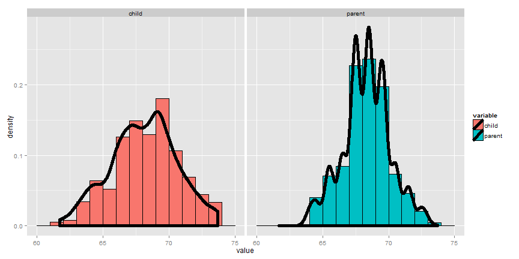
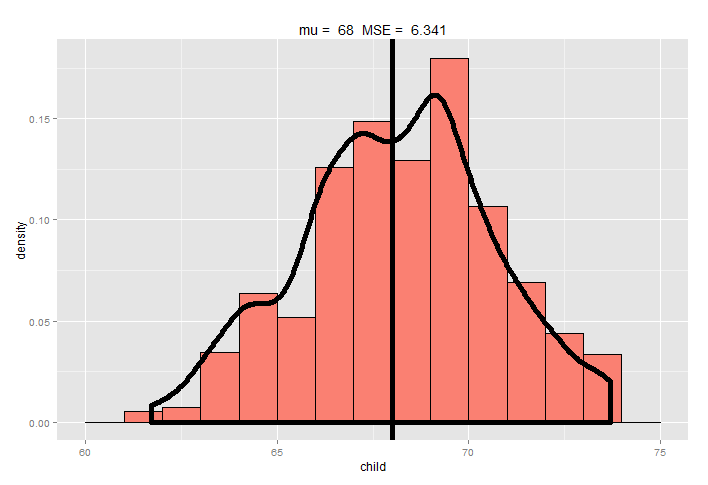
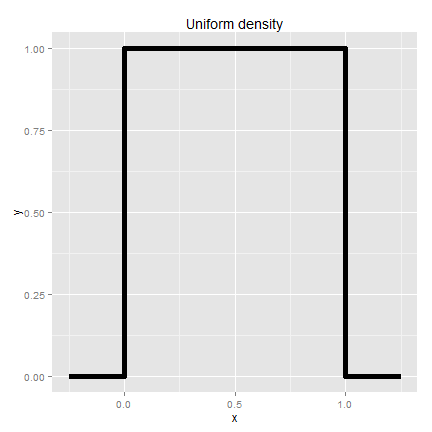
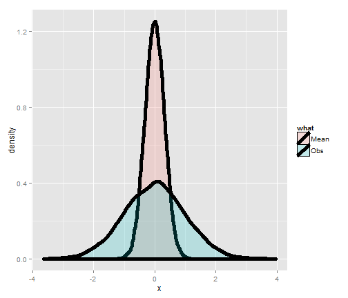
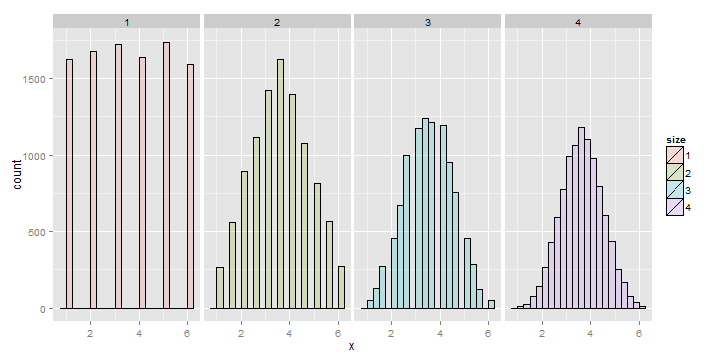
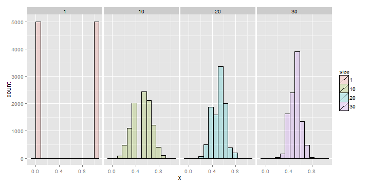

# Expected Values

## Expected values

- Expected values are useful for characterizing a distribution
- The mean is a characterization of its center
- The variance and standard deviation are characterizations of how spread out it is
- Our sample expected values (the sample mean and variance) will estimate the population versions

## The population mean

- The **expected value** or **mean** of a random variable is the center of its distribution
- For discrete random variable $X$ with PMF $p(x)$, ti is defined as follows

$$
E[X] = \sum_x xp(x)
$$

where the sum is taken over the possible values of $x$

- $E[X]$ represents the center of mass of a collection of locations and weights, {$x, p(x)$}

## The sample mean

- The sample mean estimates this population mean
- The center of mass of the data is the empirical mean

$$
\bar X = \sum_{i=1}^n x_i p(x_i)
$$

where $p(x_i) = 1/n$

## Example

Find the center of mass of the bars



## Using manipulate


```r
library(manipulate)
library(ggplot2)
library(HistData)
data(Galton)
myHist <- function(mu){
    g <- ggplot(Galton, aes(x = child))
    g <- g + geom_histogram(fill = "salmon",
                            binwidth=1,
                            aes(y = ..density..),
                            colour = "black")
    g <- g + geom_density(size = 2)
    g <- g + geom_vline(xintercept = mu, size = 2)
    mse <- round(mean((Galton$child - mu)^2), 3)
    g <- g + labs(title = paste('mu = ', mu, ' MSE = ', mse))
    g
}

manipulate(myHist(mu), mu = slider(62, 74, step = 0.5))
```

## The center of mass is the empirical mean



## Example of a population mean

- Suppose a coin is flipped and $X$ is declared 0 or 1 corresponding to a head or a tail, respectively
- What is the expected value of $X$?

$$
E[X] = .5 \times 0 + .5 \times 1 = .5
$$

- Note, if thought about geometrically, this answer is obvious; if two equal weights are spaced at 0 and 1, the center of mass will be .5


## What about a biased coin?

- Suppose that a random variable, $X$, is so that $P(X = 1) = p$ and $P(X = 0) = (1 - p)$
- (This is a biased coin when $p \neq 0.5$)
- What is its expected value?

$$
E[X] = 0 \times (1 - p) + 1 \times p = p
$$

## Example

- Suppose that a die is rolled and $X$ is the number face up
- What is the expected value of $X$?

$$
E[X] = 1 \times \frac{1}{6} + 2 \times \frac{1}{6} + 3 \times \frac{1}{6} + 4 \times \frac{1}{6} + 5 \times \frac{1}{6} + 6 \times \frac{1}{6} = 3.5
$$

- Again, the geometric argument makes this answer obvious without calculation

.png)

## Continuous random variables

- For a continuous random variable, $X$, with density, $f$, the expected value is again exactly the center of mass of the density

## Example

- Consider a density where $f(x) = 1$ for $x$ between 0 and 1
- (Is this a valid density?)
- Suppose that $X$ follows this density; what is its expected value?



## Facts about expected values

- Recall that expected values are properties of distributions
- Note the average of random variables is itself a random variable and its associated distribution has an expected value
- The center of this distribution is the same as that of the original distribution
- Therefore, the expected value of the **sample mean** is the population mean that it's trying to estimate
- When the expected value of an estimator is what its trying to estimate, we say that the estimator is **unbiased**
- Let's try a simulation experiment

## Simulation experiment

Simulating normals with mean 0 and variance 1 versus averages of 10 normals from the same population



## Averages of x die rolls



## Averages of x coin flips



## Summarizing what we know

- Expected values are properties of distributions
- The population mean is the center of mass of population
- The sample mean is the center of mass of the observed data
- The sample mean is an estimate of the population mean
- The sample mean is unbiased
    - The population mean of its distribution is the mean that it's trying to estimate
- The more data that goes into the sample mean, the more concentrated its density / mass function is around the population mean
