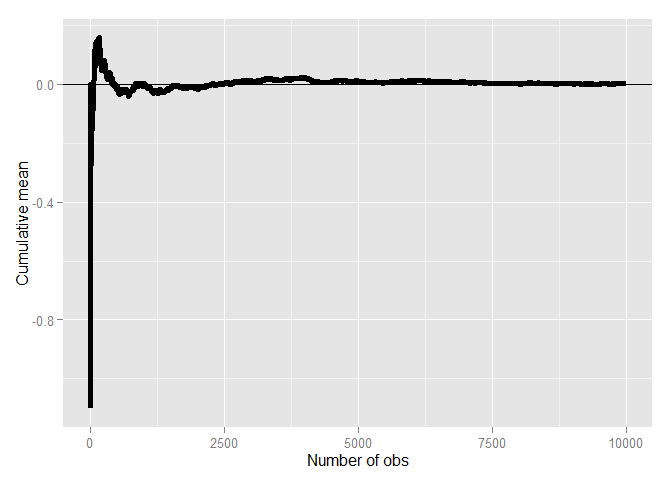

# A Trip to Asymptopia

## Asymptotic

- Asymtotics is the term for the behavior of statistics as the sample size (or some other relevant quantity) limits to infinity (or some other relevant number)
- (Asymptopia is my name for the land of asymptotics, where everything works out well and there's no messes. The land of infinite data is nice that way)
- Asymptotics are incredibly useful for simple statistical inference and approximations
- (Not covered in this class) Asymptotics often lead to nice understanding of procedures
- Asymptotics generally give no assurances about finite sample performance
- Asymptotics form the basis for frequency interpretation of probabilities (the long run proportion of times an event occurs)

## Limits of random variables

- Fortunately, for the sample mean there's a set of powerful results
- These results allow us to talk about the large sample distribution of sample means of a collection of _iid_ observations
- The first of these results we intuitively know
    - It says that the average limits to what its estimating, the population mean
    - It's called the Law of Large Numbers
    - Example $\bar X_n$ could be the average of the result of $n$ coin flips (i.e. the sample proportion of heads)
    - As we flip a fair coin over and over, it eventually converges to the true probability of a head. The LLN forms the basis of frequency style thinking
    
## Law of large numbers in action


```r
n <- 10000
means <- cumsum(rnorm(n))/(1:n)
library(ggplot2)
```

```
## Warning: package 'ggplot2' was built under R version 3.1.3
```

```r
g <- ggplot(data.frame(x = 1:n, y = means), aes(x = x, y = y)) +
    geom_hline(yintercept = 0) + geom_line(size = 2) +
    labs(x = "Number of obs", y = "Cumulative mean")
g
```

 

## Law of large numbers in action, coin flip


```r
means <- cumsum(sample(0:1, n, replace=T))/(1:n)
g <- ggplot(data.frame(x = 1:n, y = means), aes(x = x, y = y)) +
    geom_hline(yintercept = 0.5) + geom_line(size = 2) +
    labs(x = "Number of obs", y = "Cumulative mean")
g
```

 

## Discussion

- An estimator is **consistent** if it converges to what you want to estimate
    - The LLN says that the sample mean of iid sample is consistent for the population mean
    - Typically, good estimators are consistent; it's not too much to ask that if we go to the trouble of collecting an infinite amount of data that we get the right answer
- The sample variance and the sample standard deviation of iid random variables are consistent as well

## The Central Limit Theorem

- The **Central Limit Theorem** (CLT) is one of the most important theorems in statistics
- For our purposes, the CLT states that the distribution of averages of iid variables (properly normalized) becomes that of a standard normal as the sample size increases
- The CLT applies in an endless variety of settings
- The result is that

$$
\frac{\bar X_n - \mu}{\sigma / \sqrt n} = \frac{\sqrt n(\bar X_n - \mu)}{\sigma} = \frac{\mbox{Estimate - Mean of estimate}}{\mbox{Std. Err. of estimate}}
$$

has a distribution like that of a standard normal for large $n$

- (Replacing the standard error by its estimated value doesn't change the CLT)
- The useful wah to think about the CLT is that $\bar X_n$ is approximately N($\mu, \sigma^2 / n$)

## Example

- Simulate a standard normal random variable by rolling $n$ (six sided)
- Let $X_i$ be the outcome for die $i$
- Then note that $\mu = E[X_i] = 3.5$
- $Var(X_i) = 2.92$
- SE $\sqrt{2.92 / n} = 1.71 / \sqrt n$
- Let's roll $n$ dice, take their mean, subtract off 3.5, and divide by $1.71 / \sqrt n$ and repeat this over and over

## Result of our die rolling experiment


