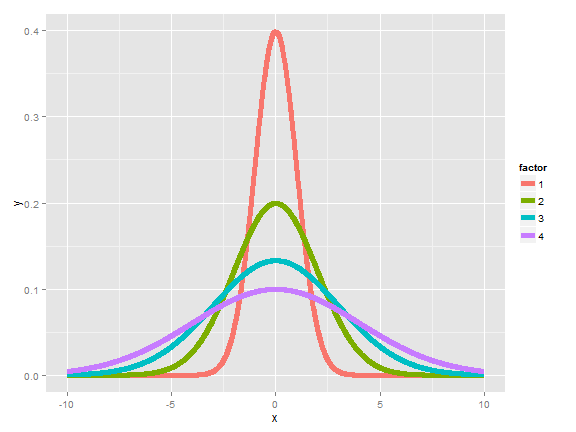
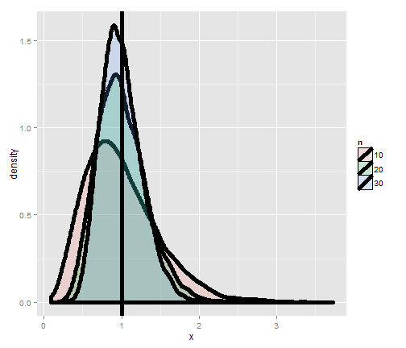
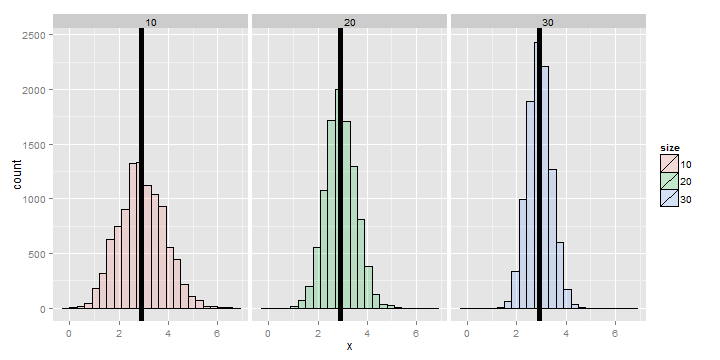
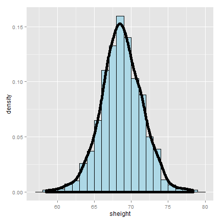

## The variance

- The variance of a random variable is a measure of _spread_
- If $X$ is a random variable with mean $\mu$, the variance of $X$ is defined as

$$
Var(X) = E[(X - \mu)^2] = E[X^2] - E[X]^2
$$

- The expected (squared) distance from the mean
- Densitities with a higher variance are more spread out than densities with a lower variance
- The square root of the variance is called the **standard deviation**
- The standard deviation has the same units as $X$

## Example

- What's the variance from the result of a toss of a die?
    - $E[X] = 3.5$
    - $E[X^2] = 1^2 \times \frac{1}{6} + 2^2 \times \frac{1}{6} + 3^2 \times \frac{1}{6} + 4^2 \times \frac{1}{6} + 5^2 \times \frac{1}{6} + 6^2 \times \frac{1}{6} = 15.17$
- $Var(X) = E[X^2] - E[X]^2 \approx 2.92$

- What's the variance from the result of the toss of a coin with probability of heads (1) of $p$?
    - $E[X] = 0 \times (1 - p) + 1 \times p = p$
    - $E[X^2] = 0^2 \times (1 - p) + 1^2 \times p = 0 \times (1 - p) + 1 \times p = E[X] = p$
- $Var(X) = E[X^2] - E[X]^2 = p - p^2 = p(1 - p)$

## Distributions with increasing variance



## The sample variance

- The sample variance is

$$
S^2 = \frac{\sum_{i=1}(X_i - \bar X)^2}{n - 1}
$$

(almost, but not quite, the average squared deviation from the sample mean)

- It is also a random variable
    - It has an associated population distribution
    - Its expected value is the population variance
    - Its distribution gets momre concentrated around the populatiojn variance with more data
- Its square root is the sample standard deviation

## Simulation experiment

Simulating from a population with variance 1



## Variance of x die rolls



## Recall the mean

- Recall that the average of random sample from a population is itself a random variable
- We know that this distribution is centered around the population mean, $E[\bar X] = \mu$
- We also know what its variance is, $Var(\bar X) = \sigma^2/n$
- This is very useful, since we don't have repeat sample means to get its variance; now we know how it relates to the population variance
- We call the standard deviation of a statistic a standard error

## To summarize

- The sample variance, $S^2$, estimates the population variance, $\sigma^2$
- The distribution of the sample variance is centered around $\sigma^2$
- The variance of sample mean is $\sigma^2/n$
    - Its logical estimate is $s^2/n$
    - The logical estimate of the standard error is $S/\sqrt n$
- $S$, the standard deviation, talks about how variable the population is
- $S/\sqrt n$, the standard error, talks about how variable averages of random samples of size $n$ from he population are

## Simulation example

Standard normals have variance 1; means of $n$ standard normals have standard deviation $1/\sqrt n$

```{r}
nosim <- 1000
n <- 10
sd(apply(matrix(rnorm(nosim * n), nosim), 1, mean))
1 / sqrt(n)
```

Standard uniforms have variance 1/12; means of random samples of $n$ uniforms have sd $1/\sqrt {12 \times n}$

```{r}
nosim <- 1000
n <- 10
sd(apply(matrix(runif(nosim * n), nosim), 1, mean))
1 / sqrt(12 * n)
```

Poisson(4) have variance 4; means of random samples of $n$ Poisson(4) have sd $2/\sqrt n$

```{r}
nosim <- 1000
n <- 10
sd(apply(matrix(rpois(nosim * n, 4), nosim), 1, mean))
2 / sqrt(n)
```

Fair coin flips have variance 0.25; means of random samples of $n$ coin flips have sd $1/(2\sqrt n)$

```{r}
nosim <- 1000
n <- 10
sd(apply(matrix(sample(0:1, nosim * n, replace=T), nosim), 1, mean))
1/(2*sqrt(n))
```

## Data example

```{r results='hide', warning=F, message=F}
library(UsingR); data(father.son);
x <- father.son$sheight
n <- length(x)
```

## Plot of the son's height



## Let's interpret these numbers

```{r}
round(c(var(x), var(x) / n, sd(x), sd(x) / sqrt(n)), 2)
```

## Summarizing what we know about variances

- The sample variance estimates the population variance
- The distribution of the sample variance is centered at what its estimating
- It gets more concentrated around the population variance with larger sample sizes
- The variance of the sample mean is the population variance divided by $n$
    - The square root is the standard error
- It turns out that we can say a lot about the distribution of averages from random samples, even though we only get one to look at in a given data set