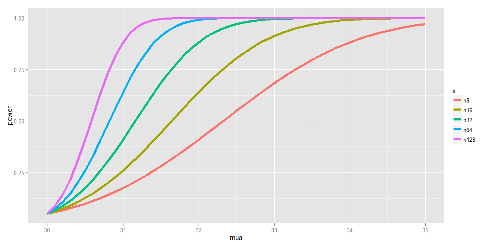

# Power

## Power

- Power is the probability f rejecting the null hypothesis when it is false
- Ergo, power (as its name would suggest) is a good thing; you want more power
- A type II error (a bad thing, as its name would suggest) is failing to reject the null hypothesis when it's false; the probability of a type II error is usually called $\beta$
- Note: Power = 1 - $\beta$

## Notes

- Consider our previous example involving RDI
- $H_0 : \mu = 30$ versus $H_\alpha : \mu > 30$
- Then power is

$$
P\left(\frac{\bar X-30}{s/\sqrt n}>t_{1-\alpha,n-1};\mu=\mu_\alpha\right)
$$

- Note that this is a function that depends on the specific value of $\mu_\alpha$!
- Notice as $\mu_\alpha$ approaches 30 the power approaches $\alpha$

## Calculating power for Gaussian data

- We reject if $\frac{\bar X-20}{\sigma/\sqrt n} > z_{1-\alpha}$
    - Equivalently if $\bar X > 30 + Z_{1-\alpha}\frac{\sigma}{\sqrt n}$
- Under $H_0 : \bar X\sim N(\mu_0,\sigma^2/n)$
- Under $H_\alpha : \bar X\sim N(\mu_\alpha,\sigma&2/n)$
- So we want


```r
alpha <- 0.05
z <- qnorm(1 - alpha)
pnorm(mu0 + z * sigma/sqrt(n), mean=mua, sd=sigma/sqrt(n), lower.tail=F)
```

## Example continued
- $\mu_\alpha = 32, \mu_0 = 30, n = 15, \sigma = 4$


```r
mu0 <- 30
mua <- 32
sigma <- 4
n <- 16
alpha <- 0.05
z <- qnorm(1 - alpha)
pnorm(mu0 + z * sigma/sqrt(n), mean=mu0, sd=sigma/sqrt(n), lower.tail=F)
```

```
## [1] 0.05
```

```r
pnorm(mu0 + z * sigma/sqrt(n), mean=mua, sd=sigma/sqrt(n), lower.tail=F)
```

```
## [1] 0.63876
```

## Plotting the power of the curve



## Graphical Depiction of Power


```r
library(manipulate)
mu0 <- 30
myplot <- function(sigma, mua, n, alpha) {
    g <- ggplot(data.frame(mu=c(27, 36)), aes(x=mu)) +
        stat_function(fun=dnorm, geom="line", args=list(mean=mu0, sd=sigma/sqrt(n)), size=2, col="red") +
        stat_function(fun=dnorm, geom="line", args=list(mean=mua, sd=sigma/sqrt(n)), size=2, col="blue")
    xitc <- mu0 + qnorm(1 - alpha) * sigma/sqrt(n)
        g + geom_vline(xintercept=xitc, size=3)
}

manipulate(myplot(sigma, mua, n, alpha), sigma=slider(1, 10, step=1, initial=4),
           mua=slider(30, 35, step=1, initial=32), n=slider(1, 50, step=1, initial=16),
           alpha=slider(0.01, 0.1, step=0.01, initial=0.05))
```

## Question

- When testing $H_\alpha : \mu > \mu_0$, notice if power is 1 - $\beta$, then

$$
1 - \beta = P\left(\bar X > \mu_0 + z_{1-\alpha}\frac{\sigma}{\sqrt n};\mu=\mu_\alpha\right)
$$

- where $\bar X \sim N(mu_\alpha,\sigma^2/n)$
- Unknowns: $\mu_\alpha, \sigma, n, \beta$
- Knowns: $\mu_0, \alpha$
- Specify any 3 of the unknowns and you can solve for the remainder

## Notes

- The calculation for $H_\alpha : \mu < \mu_0$ is similar
- For $H_\alpha : \mu \ne \mu_0$ calculate the one-sided power using $\sigma/2$ (this is only approximately right, it excludes the probability of getting a large TS in the opposite direction of the truth)
- Power goes up as $\alpha$ gets larger
- Power of a one-sided test is greater than the power of the associated two-sided test
- Power goes up as $\mu_1$ gets further away from $\mu_0$
- Power goes up as $n$ goes up
- Power doesn't need $\mu_\alpha, \sigma, and n$, instead only $\frac{\sqrt n(\mu_\alpha-\mu_0)}{\sigma}$
    - The quantity $\frac{\mu_\alpha-\mu_0}{\sigma} is called the effective size, the difference in the means in standard deviation units
    - Being unit free, it has some hope of interpretability across settings
    
## T-test power

- Consider calculating power for a Gossett's $T$ test for our example
- The power is

$$
P\left(\frac{\bar X - \mu_0}{S/\sqrt n} > t_{1-\alpha,n-1};\mu=\mu_\alpha\right)
$$

- Calculating this requires the non-central $t$ distribution
- `power.t.test` does this very well
    - Omit one of the arguments and it solves for it
    
## Example
    

```r
power.t.test(n=16, delta=2/4, sd=1, type="one.sample", alt="one.sided")$power
```

```
## [1] 0.6040329
```

```r
power.t.test(n=16, delta=2, sd=4, type="one.sample", alt="one.sided")$power
```

```
## [1] 0.6040329
```

```r
power.t.test(n=16, delta=100, sd=200, type="one.sample", alt="one.sided")$power
```

```
## [1] 0.6040329
```

```r
power.t.test(power=0.8, delta=2/4, sd=1, type="one.sample", alt="one.sided")$n
```

```
## [1] 26.13751
```

```r
power.t.test(power=0.8, delta=2, sd=4, type="one.sample", alt="one.sided")$n
```

```
## [1] 26.13751
```

```r
power.t.test(power=0.8, delta=100, sd=200, type="one.sample", alt="one.sided")$n
```

```
## [1] 26.13751
```
